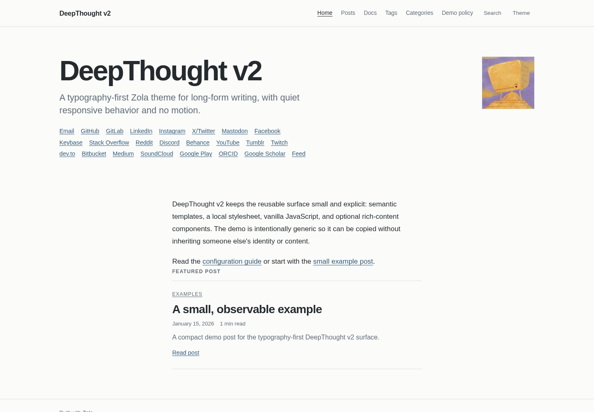

# DeepThought v2

DeepThought v2 is a typography-first Zola theme for long-form writing. It keeps the page surface editorial and quiet: semantic HTML, a readable prose measure, responsive overflow containment, light/dark palettes, and no CSS motion. The reusable implementation lives in this theme repository; a consuming site keeps its own content and configuration.



## Screenshots

| View | Light | Dark |
| --- | --- | --- |
| Mobile, 390px | [light](screenshots/deepthought-v2-mobile-light.png) | [dark](screenshots/deepthought-v2-mobile-dark.png) |
| Desktop, 1440px | [light](screenshots/deepthought-v2-desktop-light.png) | [dark](screenshots/deepthought-v2-desktop-dark.png) |
| Wide, 2560px | [light](screenshots/deepthought-v2-wide-light.png) | [dark](screenshots/deepthought-v2-wide-dark.png) |

These are screenshots of the standalone demo generated from this checkout, not a mockup or a consuming site.

## Requirements

- Zola 0.23.6 or newer
- Tera 2 template support, provided by Zola 0.23.6+
- Node.js and Playwright only for the browser regression harness and screenshots

## Installation

Install or clone this repository at `themes/DeepThought` in a Zola site, then select the directory identifier exactly as follows:

```toml
theme = "DeepThought"
```

The install identifier is `DeepThought`; `DeepThought v2` is the display name in `theme.toml`. Keep the original `LICENSE` and attribution when redistributing the theme.

## Minimum configuration

Only these site values are required:

```toml
base_url = "https://example.com"
title = "An example site"
theme = "DeepThought"
```

The theme does not require a policy page, author table, social table, favicon table, analytics credentials, comments credentials, navigation table, or search index. It renders no search controls or search-index asset requests when `build_search_index` is omitted or false.

## Configuration contract

The existing configuration tables remain supported:

- `extra.author`: optional `name` and `avatar`.
- `extra.social`: optional email, GitHub, GitLab, LinkedIn, Instagram, X/Twitter, Mastodon, Facebook, Keybase, Stack Overflow, Reddit, Discord, Behance, YouTube, Tumblr, Twitch, dev.to, Bitbucket, Medium, SoundCloud, Google Play, ORCID, Google Scholar, and feed links.
- `extra.navbar_items`: optional language-specific navigation; `$BASE_URL` is replaced with `config.base_url`.
- `extra.favicon`: optional `favicon_16x16`, `favicon_32x32`, `apple_touch_icon`, `safari_pinned_tab`, and `webmanifest` paths.
- `extra.analytics.google`: optional Google Analytics ID.
- `extra.commenting.disqus`: optional Disqus shortname; a page must also set `extra.comments = true`.
- Rich-feature tables: optional `katex`, `chart`, `mermaid`, `galleria`, and `mapbox` settings.

The v2 additions are deliberately small:

```toml
[extra]
# Optional. Omit to render no featured block.
featured_page = "posts/post-0.md"

[extra.policy]
# Optional. Omit the whole table to render no policy link.
label = "AI Policy"
url = "$BASE_URL/ai-policy/"
```

`featured_page` is resolved with Zola's `get_page` only when configured. `extra.policy.url` is resolved with the same `$BASE_URL` replacement as navigation; the theme does not call `get_page` for the policy URL, so a consumer can point at an externally managed route. A Mastodon username with a leading `@` is normalized before the profile URL is emitted.

### Search and highlighting

```toml
build_search_index = true

[markdown.highlighting]
theme = "github-dark-accessible"
extra_themes = ["highlighting/github-dark-accessible.json"]
```

The standalone demo can use the theme-relative highlighting path above. In a parent consumer, Zola resolves `extra_themes` relative to the directory containing `config.toml`, so use:

```toml
extra_themes = ["themes/DeepThought/highlighting/github-dark-accessible.json"]
```

This is a path-resolution exception; highlighting files are not found through ordinary theme static lookup.

### Rich content

The theme includes semantic components for `chart`, `galleria`, `katex`, `mapbox`, `mermaid`, `vimeo`, and `youtube`. Enable only what is needed:

```toml
[extra]
katex.enabled = true
katex.auto_render = true
chart.enabled = true
mermaid.enabled = true
galleria.enabled = true

[extra.mapbox]
enabled = true
access_token = "your-public-token"
```

Local markup provides responsive video aspect ratios, bounded chart/diagram/map/gallery areas, and overflow-safe prose. Mermaid, Chart.xkcd, Galleria, Mapbox, and KaTeX execute from third-party CDNs; network availability and provider behavior are not local theme guarantees. Analytics and comments are not enabled in the standalone demo.

More examples live in [`content/docs/extended-shortcodes/index.md`](content/docs/extended-shortcodes/index.md), and the full configuration reference is [`content/docs/config-options.md`](content/docs/config-options.md).

## v1 to v2 upgrade notes

- The reusable templates and assets are now the v2 surface in this repository; keep site-specific content/configuration in the consuming site.
- Bulma, Font Awesome/Academicons, the old `deep-thought.css` payload, and the Sass tree are removed. Do not carry old visual overrides forward without reviewing their selectors.
- The primary static assets are `site.css` and `js/site.js`.
- The page structure is semantic and no longer depends on Bulma utility classes or icon fonts.
- Search, theme persistence, focus containment, taxonomy pages, pagination, metadata, comments gating, and rich-content markup remain supported.
- Add `featured_page` or `[extra.policy]` only when the consumer wants those optional blocks.

## Local development and verification

From this repository:

```sh
export ZOLA=/path/to/zola-0.23.6
"$ZOLA" --version
"$ZOLA" build --force --output-dir /tmp/deepthought-v2-demo
"$ZOLA" build --drafts --force --output-dir /tmp/deepthought-v2-demo-drafts
"$ZOLA" check --drafts --skip-external-links
PYTHONDONTWRITEBYTECODE=1 ZOLA="$ZOLA" python3 -m unittest discover -s tests -v
node --check static/js/site.js
node --check tests/browser_regressions.js
node --check tests/capture_screenshots.js  # when present
NODE_PATH="$(npm root -g)" PORT=8865 node tests/browser_regressions.js /tmp/deepthought-v2-demo
```

`ZOLA` is optional in the Python tests; when unset they resolve `zola` from `PATH`. The external-link check may report genuinely unavailable CDN URLs. Local template/build failures are not expected and should be treated as defects.

## Supported surface

The theme supports:

- responsive home, page, section, taxonomy, 404, and policy templates;
- page and section metadata, canonical URLs, optional descriptions/images, dates, reading time, word count, categories, tags, TOC, and all six Zola adjacency variants;
- optional author/avatar, broad social links, favicons, analytics, Disqus comments, navigation, featured post, policy link, and feeds;
- search with result navigation, focus containment/restoration, Escape handling, background inertness, and unavailable-storage handling;
- immediate light/dark switching with persistence and accessible control state;
- Markdown code/table/link overflow containment and accessible syntax highlighting;
- the rich-content components listed above.

## Attribution and license

DeepThought originated as the open-source project by Ratan Kulshreshtha. This v2 work preserves the original author attribution and MIT license; see [`LICENSE`](LICENSE) and [`theme.toml`](theme.toml). The v2 fork homepage is [github.com/manank20/DeepThought](https://github.com/manank20/DeepThought).
